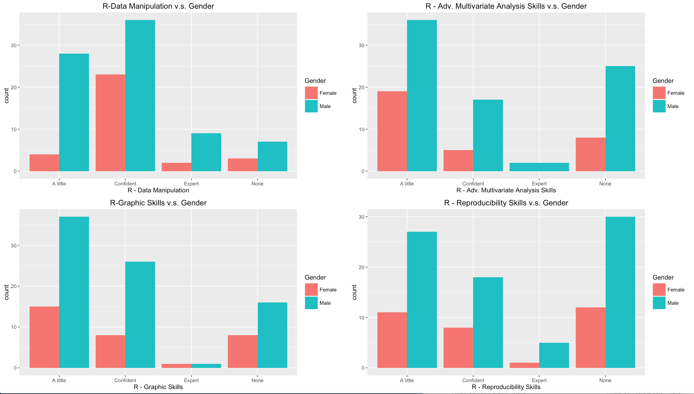
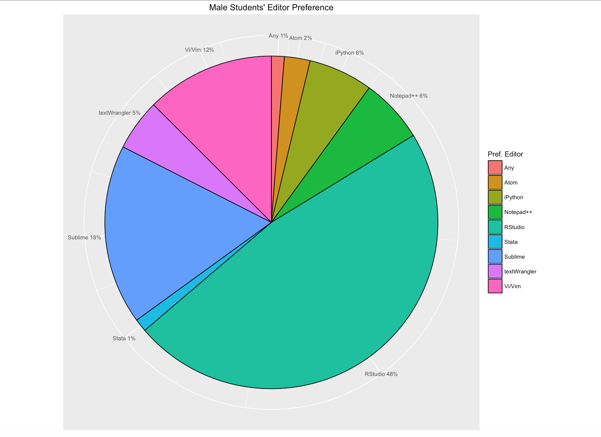
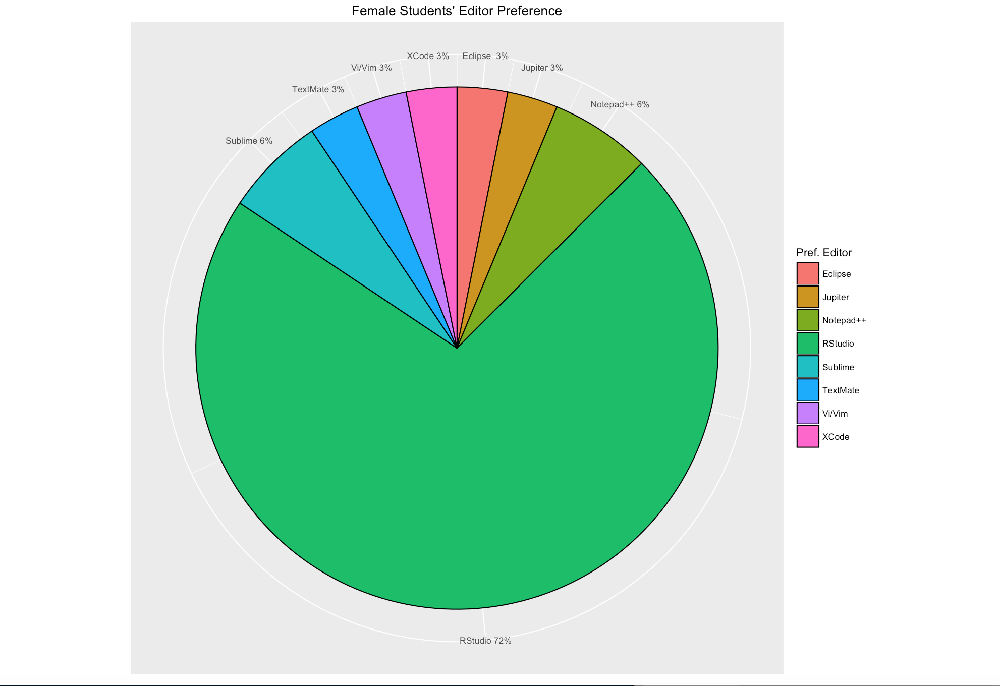
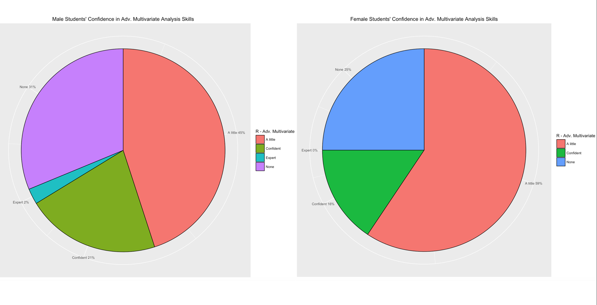
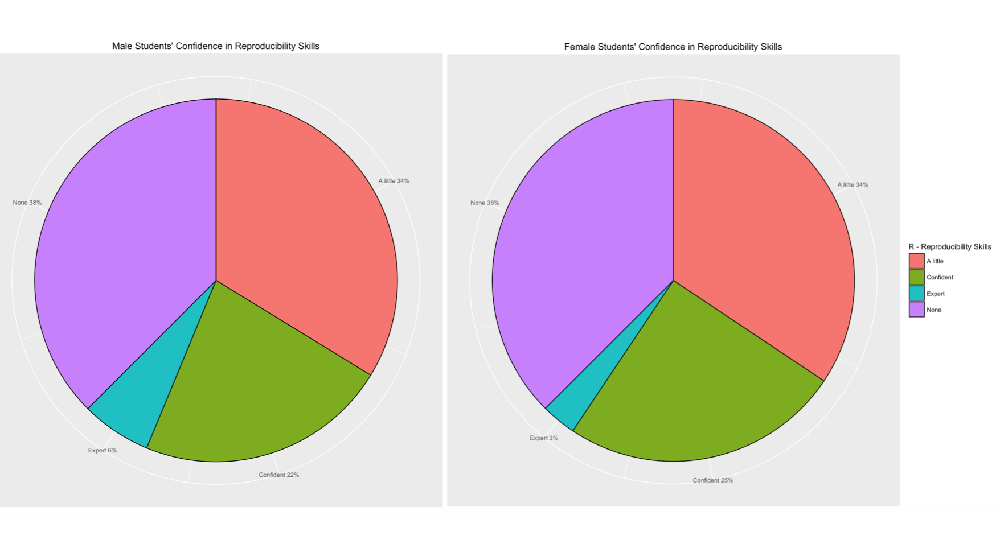
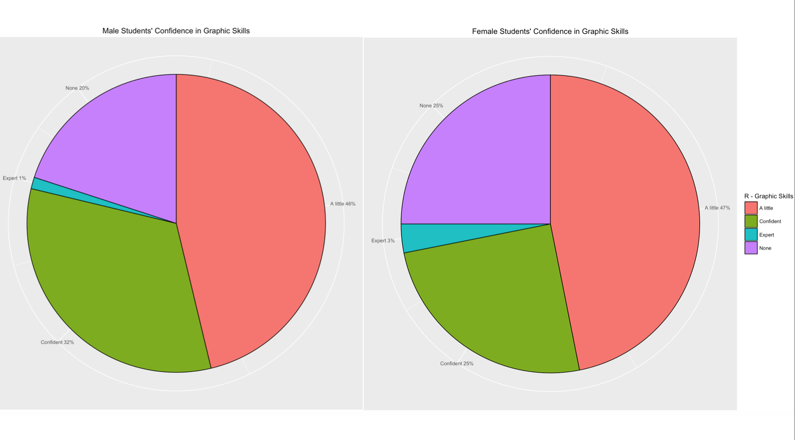
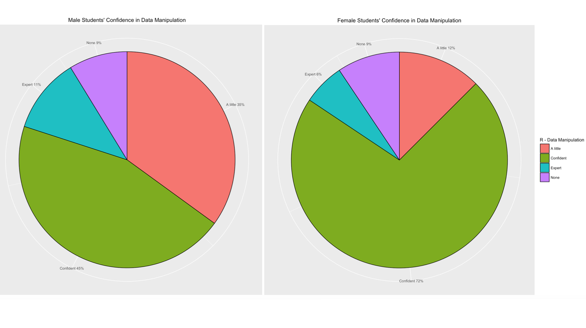

## Introduction

On this project we look into the EDAV course intro survey data to explore the characteristics of enrolled students and their proficiency with a number of tools useful for the course. First we will start by performing exploratory analysis on the data, analyzing the distribution of each of the variables. Asides from the skill-related information, the survey provides us with some demographic data, such as the gender of each of the students, which program they come from and their enrollment status for the course (enrolled vs. on waitlist). Using the demographic data we are able to generate conditional analysis on the skills and tools data, to identify if there are significant differences between the populations. Finally we dive deeper into the data by generating a skill ranking system for each of the students and correlation, cluster and PCA analysis on the distributions of tools and skills.

```{r global_options, include=FALSE}
knitr::opts_chunk$set(fig.width=12, fig.height=8, echo=FALSE, warning=FALSE, message=FALSE)
```

```{r libraries}
source("https://raw.githubusercontent.com/briatte/ggcorr/master/ggcorr.R")
library(gdata)
library(ggplot2)
library(GGally)
library(plyr)
library(stats)
library(devtools)
library(ggbiplot)
library(reshape2)
library(Rmisc)
library(knitr)
```

## Data Cleaning

Before starting to analyze the data, first we are required to clean it and standardize for ease of access. Below we outline the steps taken for this, with specific available at the code file.

1. The input file contains a number of rows that provide no information (i.e. all *NA* values). We will proceed to delete these.

2. The second column, *Program*, contains distinct entries that refer to the same  program, such as "IDSE (master)" and "master in ds". We will standardize this.

3. The third column, *Experience with tools*, is in the form of a list within each row. For purposes of our analysis we need to parse the column into a number of binary variables that will indicate wether or not a given student has experience with a particular tool.

4. Similar to point *2*, the *Preferred Editor* column contains redundant entries. We proceed to standardize and clean these up.

5. For *Gender*, two entries did not correspond to male or female. We have randomly assigned one of the 2 genders to them (given the large number of observations the impact of this transformation is negligible).

Below is a snapshot of how the final working data frame looks like.

```{r}
survey <- read.xls("Survey+Response.xlsx", stringsAsFactors = F)

## Add ID variable.
survey <- cbind(1:nrow(survey), survey)

## Drop useless columns and rename the good ones.
survey <- survey[,colSums(is.na(survey))<nrow(survey)]
newNames <- c("id", "Waitlist", "Program", "Tools", "R - Data Manipulation", "Gender", "Pref. Editor", "R - Graphic Skills", "R - Adv. Multivariate Analysis Skills", "R - Reproducibility Skills", "Matlab Skills", "Github Skills")
names(survey) <- newNames

## Get list of all available "tools".
toolsList <- as.character(survey$Tools)
toolsList <- strsplit(toolsList, ",")
toolsList <- unique(trim(unlist(toolsList)))
lg <- length(toolsList)

## Make binary variables for each tool.
test <- data.frame(survey$id, survey$Tools, stringsAsFactors = F)
names(test) <- c("id", "tools")
out <- data.frame(matrix(ncol=lg, nrow=0))
names(out) <- toolsList

make_row = function(x) {
  m <- c(rep(NA,lg))
  names(m) <- toolsList
  v = as.character(unique(trim(unlist(strsplit(x[1,2], ",")))))
  m[v] = 1
  m
}

outFile <- ddply(.data=test, .variables=.(id), .fun=make_row)

surveyNew <- merge(survey, outFile, by="id")
surveyNew <- surveyNew[!(names(surveyNew) %in% c("Tools"))]
names(surveyNew)[c(19,20,21,23,27)] <- c("Dropbox", "Google Drive", "RegEx", "Shell", "Web")

## Turn to binary variable.
surveyNew[is.na(surveyNew)] <- 0

## Clean program options.
surveyNew[surveyNew$Program == "Ms in ds",]$Program <- "IDSE (master)"
surveyNew[surveyNew$Program == "MSDS",]$Program <- "IDSE (master)"
surveyNew[surveyNew$Program == "Data Science",]$Program <- "IDSE (master)"
surveyNew[surveyNew$Program == "QMSS (master)",]$Program <- "QMSS"
surveyNew[surveyNew$Program == "Data Science Certification",]$Program <- "IDSE (certificate)"
surveyNew[surveyNew$Program == "PhD Biomedical Informatics",]$Program <- "Ph.D."

## Clean text editor.
surveyNew[surveyNew$`Pref. Editor` == "Any (20 years C++/Java experience)",]$`Pref. Editor` <- "Any"
surveyNew[grepl("sublime", surveyNew$`Pref. Editor`, ignore.case=T),]$`Pref. Editor` <- "Sublime"
surveyNew[surveyNew$`Pref. Editor` == "I used jupyter last semester",]$`Pref. Editor` <- "Jupiter"
surveyNew[surveyNew$`Pref. Editor` == "textwrangler",]$`Pref. Editor` <- "textWrangler"
surveyNew[surveyNew$`Pref. Editor` == "Text Wrangler",]$`Pref. Editor` <- "textWrangler"
surveyNew[surveyNew$`Pref. Editor` == "python",]$`Pref. Editor` <- "iPython"
surveyNew[surveyNew$`Pref. Editor` == "ipynb",]$`Pref. Editor` <- "iPython"
surveyNew[surveyNew$`Pref. Editor` == "Webstorm, pycharm",]$`Pref. Editor` <- "iPython"
surveyNew[surveyNew$`Pref. Editor` == "notepad++",]$`Pref. Editor` <- "Notepad++"
surveyNew[surveyNew$`Pref. Editor` == "xcode",]$`Pref. Editor` <- "XCode"
surveyNew[surveyNew$`Pref. Editor` == "vi/vim",]$`Pref. Editor` <- "Vi/Vim"
surveyNew[surveyNew$`Pref. Editor` == "haven't used any",]$`Pref. Editor` <- "None"

## Clean gender.
surveyNew[surveyNew$Gender == "",]$Gender <- "he/him"
surveyNew[surveyNew$Gender == "doesn't matter",]$Gender <- "she/her"

head(surveyNew,3)
```

# Exploratory Data Analysis

```{r Exploratory1}
library(gdata)
library(ggplot2)
library(plyr)
library(Rmisc)

tools_line <- surveyNew[c(2, 3, 5, 12:31)]
tools_line[is.na(tools_line[,])] <- 0
tools_line[tools_line == "Yes"] <- 1

x <- tools_line[c(4:23)]
x <- data.matrix(x)
tools_line <- cbind(tools_line, Total = rowSums(x))

program_tools <- tools_line[c(2, 24)]

ggplot(data.frame(x = c(-2, 23)), aes(x)) +
        stat_function(fun = dnorm, args = list(mean = mean(subset(program_tools, Program == "IDSE (master)")$Total), 
                                               sd = sd(subset(program_tools, Program == "IDSE (master)")$Total)), aes(colour = "IDSE (master)"), size=1.5) +
        stat_function(fun = dnorm, args = list(mean = mean(subset(program_tools, Program == "Other masters")$Total), 
                                               sd = sd(subset(program_tools, Program == "Other masters")$Total)), aes(colour = "Other masters"), size=1.5) +
        stat_function(fun = dnorm, args = list(mean = mean(subset(program_tools, Program == "IDSE (certificate)")$Total), 
                                               sd = sd(subset(program_tools, Program == "IDSE (certificate)")$Total)), aes(colour = "IDSE (certificate)"), size=1.5) +
        stat_function(fun = dnorm, args = list(mean = mean(subset(program_tools, Program == "Statistics (master)")$Total), 
                                               sd = sd(subset(program_tools, Program == "Statistics (master)")$Total)), aes(colour = "Statistics (master)"), size=1.5) +
        stat_function(fun = dnorm, args = list(mean = mean(subset(program_tools, Program == "QMSS")$Total), 
                                               sd = sd(subset(program_tools, Program == "QMSS")$Total)), aes(colour = "QMSS"), size=1.5) +
        stat_function(fun = dnorm, args = list(mean = mean(subset(program_tools, Program == "Ph.D.")$Total), 
                                               sd = sd(subset(program_tools, Program == "Ph.D.")$Total)), aes(colour = "Ph.D."), size=1.5) +
        stat_function(fun = dnorm, args = list(mean = mean(subset(program_tools, Program == "Applied Math")$Total), 
                                               sd = sd(subset(program_tools, Program == "Applied Math")$Total)), aes(colour = "Applied Math"), size=1.5) +
        stat_function(fun = dnorm, args = list(mean = mean(subset(program_tools)$Total), 
                                               sd = sd(subset(program_tools)$Total)), size=1, linetype=2, colour="black") +
        scale_colour_manual("Program", values = c("white","#0066CC", "#FFF999", "#FF6666", "#99FF99", "#FF9933", "#CC66FF")) +
        labs(x = "Number of Tools") +
        labs(y = "") +
        theme_classic() +
        labs(title = "Experience with Tools by Program") 
```
    
The graph above shows the normal curves of the number of tools that students have experience with, based on what program they are in. The black, dashed line is the normal curve for the number of tools that students have experience with for the entire class, not taking into account what program they are in. You'll notice that the normal curve for the Applied Math students is missing. This is because there is only one Applied Math student according to the survey data. This student has experience in 5 tools, which, compared to the averages of the other programs, is the lowest.    
        
At first glance, you might notice that the orange normal curve, which is for the QMSS students, is significantly farther to the right than the other curves, indicating that QMSS students, on average, have experience with the most amount of tools (12.33333). The QMSS curve is also the widest, suggesting that the range of number of tools that students have experience with is large.  
        
The purple normal curve, for the Statistics (master) students, is the farthest to the left, indicating that those students have experience with the least amount of tools on average (excluding the Applied Math students). This curve is also tall and narrow, suggesting that the number of tools that these students have experience with does not stray too far from the mean. It makes sense that the statistics and math students have experience with less of these tools on average compared to programs like IDSE (master), IDSE (certificate), and QMSS, considering that the latter programs are likely more focused on computer programming.  
        
The yellow, red, and blue normal curves, for the IDSE (masters), Other Masters, and IDSE (certificate) students, respectively, look to be clustered in the same area, and in fact, their means vary by less than 1 and standard deviations differ by less than .2. Considering the fact that almost 80% of the class is in one of these 3 programs, it should come as no surprise that the black, dashed normal curve representing the class as a whole is also in this cluster. As one might expect, the IDSE (master) students have experience with more tools than the IDSE (certificate) students on average.   
        
The mint normal curve for the Ph.D. students is the tallest and most narrow, indicating that compared to all of other programs, the number of tools that these students have experience with varies the least. The Ph.D. average is  larger than the class average, which I assume can be attributed to the fact that they are working towards getting the highest-level degree of anyone in the class. 
       

Experience With Tools by Gender
---
```{r Exploratory2}
gender_tools <- tools_line[c(3, 24)]
cbPalette <- c("#99CCFF", "#FF9933")
norm <- ggplot(data.frame(x = c(-2, 18)), aes(x)) +
        stat_function(fun = dnorm, args = list(mean = mean(subset(gender_tools, Gender == "he/him")$Total), 
                                               sd = sd(subset(gender_tools, Gender == "he/him")$Total)), aes(colour = "he/him"), size=2) +
        stat_function(fun = dnorm, args = list(mean = mean(subset(gender_tools, Gender == "she/her")$Total), 
                                               sd = sd(subset(gender_tools, Gender == "she/her")$Total)), aes(colour = "she/her"), size=2) +
        stat_function(fun = dnorm, args = list(mean = mean(subset(program_tools)$Total), 
                                               sd = sd(subset(program_tools)$Total)), size=1, linetype=2, colour="black") +
        scale_colour_manual("Gender", values = c("#99CCFF", "#FF9933")) +
        labs(x = "Number of Tools") +
        labs(y = "") +
        labs(title = "Experience with Tools by Gender") +
        theme_classic()
bar <- ggplot(data=surveyNew, aes(x=Program, fill=Gender)) +
        geom_bar(stat="count", position=position_dodge()) +
        labs(y = "") + 
        scale_fill_manual(values=cbPalette) +
        labs(title = "Students in Program by Gender") +
        theme_classic()

multiplot(norm, bar)
```
        
        
The graph above plots the normal curves of the number of tools that students have experience with, based on their gender. The black, dashed line is the normal curve for the number of tools that students have experience with for the entire class, not taking into account gender. 

The normal curve for the entire class is similar to that of the male students, and certainly more similar to the male students than the females. This is likely because there are more than double the amount of males in the class than there are females. Also, the curve for the females is taller and slightly skinnier, which means the amount of tools that females have experience with varies less than that of the males. 
        
The difference in averages between the genders is most likely do to the programs in which the students are enrolled. There is more than 3 times as many males in the IDSE (master) program than there are females, and that program had the second largest average for the number of tools that students had experience with. Further, the program that had the second most amount of females in it was the Statistics (master) program, which had the second lowest average for the number of tools that students had experience with.

## Conditional Distributions














## Correlation, Cluster Analysis and PCA on Skills

For this part of the analysis, we will focus our attention on the *Tools* that each of the students listed as being comfortable with. There are a total of 20 different reported tools, an we would like to investigate if some of these tend to appear in groups. An obvious example is to expect that *R* and *RStudio* are generally reported together, while *Web* and *Matlab* probably are not so closely related.

The list of reported skills are:

```{r ToolsList}
inputCluster <- surveyNew[12:31]
colnames(inputCluster)
```

As a first step, we begin by analyzing the correlation across tools. The observed relationship is presented on the matrix below.

```{r CorrelationMatrix}
names(inputCluster)[14] <- "Sweave"
names(inputCluster)[17] <- "C"
cov_mat = cov(inputCluster)
ggcorr(cov_mat)
```

Notice that skills in R and RStudio are very strongly correlated - the two applications are very similar and they indicate the same skill in R; Dropbox and Google Drive are also highly correlated because they are both storage applications; Web and XML have strong correlation because they are highly related skill sets; Shell and Github are correlated because people who use Github tend to write command lines in Shell; it is interesting to see that SQL and Shell also have strong correlations too. In addition, there are skills that are negatively correlated. For instance, Web, XML, Shell, Github, and SQL all have strong negative relationships with SPSS. It makes sense because SPSS is a statistical package for social science - people who know SPSS tend to come from a social science background and hence don't know much about web development and data science. Further, Stata and Github have strong negative correlation because data scientists and statisticians who use Github for storage and collaboration are likely to be expert in R and hence would not use STATA. In sum, the correlation matrix gives us a clear view of which skills are highly related. It also gives us an idea of which skills are transferable to one another.

The correlation matrix gives us a good idea of how the skills relate pairwise, but it would be interesting to see how each of them relate to the rest, giving us a broader picture. Building a hierarchical binary dendrogram is useful for this.

```{r Hierarchical Dendogram}
## Cluster Dendogram.
d <- dist(t(inputCluster), method = "binary")
hc <- hclust(d)
plot(hc, xlab = "Skills")
```

This picture provides us some interesting insights:

1. As expected, *R* & *RStudio* are closely related, followed by *Python*. These tools can be considered the core of the Data Scientist.
2. *Excel*, *Dropbox* and *Google Drive* also cluster together. These can be considered the least technical of the skills.
3. *XML* and *Web* go together, which makes sense considering XML and HTML are basically the same language.
4. *Stata*, *SPSS*, *Sweave* & *Latice* are tools closely related to each other. Generally these are more associated to the social sciences, or the QMSS program.

As a next step, we will perform a PCA analysis on the tools data. The idea is to reduce the dimensionality of the data by finding which tools are similar enough to be grouped with each other, so a visual representation of the data becomes possible (visualizing 20-dimensional data is a complex task). First we derive 10 PCA components, and investigate how much variance each of them explains.

```{r PCA}
## Training an labeled data.
programs <- (surveyNew[,3])

pca <- prcomp(inputCluster)
plot(pca, type = "l")
summary(pca)
```

The table shows us that 30% of the variance in the data can be explained by 2 components, and almost 70% by 7 of them. For purposes of visualization, we will take only 2 components and see how the skills can be represented in space, while we also investigate their different distributions across academic programs.

```{r PCA Viz}
g <- ggbiplot(pca, obs.scale = 1, var.scale = 1, groups = programs,
              ellipse = TRUE, circle = TRUE)
g <- g + scale_color_discrete(name = '')
g <- g + theme(legend.direction = 'horizontal',
               legend.position = 'top')
print(g)
```

Again we see some interesting patterns: the least technical skills (*Excel*, *Dropbox*, *Google Drive*, etc.) are grouped on the upper left quadrant, while the more technical ones on the lower left. *SPSS* in particular has an X component with a distinct direction than the rest of the tools, indicating a dissociation with them.

Related to the programs, we see that all of them are very similar, with 2 interesting exceptions:
1. The *Statistics (master)* group is shifted towards the right, indicating a different familiarity with tools. This group can be associated with the *SPSS* vector.
2. The *QMSS* group is the broadest one, implying that their skills vary significantly form student to student. This is something we already observed on previous analysis from our study.

## Can the Students be Ranked?

First, we assign a weight to each skill and a confidence score to each student. For each skill (*ggplot2*,*dropbox*,*R* *etc..*), its weight is inversely proportion to the number of students that have it. For example, *R* has a score of **21** as many students know it while the skill such as *lattice* has a very high score of **97** as very few students know it. Confidence score of the student is his average rating calculated by assigned ratings to each confidence level (Expert = ***4***, Confident = ***3***, A little = ***2***, None = ***1***). We use these two metrics to calculate weighted and unweighted score a student. 

Unweighted score of the student is the sum of all the weights of the skills that he know. Weighted score is the product of unweighted score with the weight of student calculated above using the confidence measures. The graphs below depict the weights and scores calculated so far. 

```{r echo=FALSE}
names <- names(surveyNew)
backupSurvey <- surveyNew
#print(names)
#colsums <- colSums(!is.na(surveyNew))
colsums <- colSums(!(surveyNew) == 0)
colnames <- names(colsums)
#print(colnames)
colWeights <- (1 - colsums/nrow(surveyNew))
surveyNew <- backupSurvey
#print(colWeights)
for (col in names(surveyNew))
{
  if (colWeights[col]!=0)
  {
    #surveyNew[[col]][!is.na(surveyNew[[col]])] <- floor(colWeights[col]*100)
    surveyNew[[col]][!(surveyNew[[col]]==0)] <- floor(colWeights[col]*100)
    #surveyNew[[col]][is.na(surveyNew[[col]])] <- 0
  } else{
    surveyNew[[col]][surveyNew[[col]] == "Confident"] <- 3
    surveyNew[[col]][surveyNew[[col]] == "Expert"] <- 4
    surveyNew[[col]][surveyNew[[col]] == "A little"] <- 2
    surveyNew[[col]][surveyNew[[col]] == "None"] <- 1
  }
}

score_student = function(x) {
  columns <- names(x)
  weightSkill <- 0
  weightStudent <- 0
  for (col in columns){
    if (colWeights[col]!=0){
      weightSkill <- weightSkill + as.integer(x[[col]])
    } else {
      if (x[[col]]<5 && col!="id"){
        weightStudent <- weightStudent + as.integer(x[[col]])
      }
    }
  }
  #print(weightSkill)
  #print(floor(weightStudent*10/24))
  c(weightSkill/10, floor(weightStudent*10/24))
}

values = apply(surveyNew,1,score_student)
Unweighted_scores = values[1,]
score_Weights = values[2,]
Weighted_scores = score_Weights*Unweighted_scores/10
mat <- matrix(Unweighted_scores)
mat <- cbind(mat, Weighted_scores)
colnames(mat) <- c("Unweighted Score","WeightedScore")
meltedMat <- melt(mat, id.vars="StudentId")
colnames(meltedMat) <- c("StudentId","Type","Score")
AlternateValues <- ddply(meltedMat,c("StudentId","Type"))

```
The histograms of the 4 metrics calculated till now are presented below.  
```{r, echo=FALSE}
hist(floor(colWeights*100), main="Frequencies of the weights of skills", xlab="Weight Intervals",ylab="Frequency")
hist(score_Weights, main="Frequencies of the student confidence scores", xlab="Confidence Intervals", ylab="Frequency")
hist(Unweighted_scores, main="Frequencies of the un-weighted scores", xlab="Score Intervals",ylab="Frequency")
hist(Weighted_scores, main="Frequencies of the Weighted scores", xlab="Score Intervals",ylab="Frequency")

plot_scores = function(Weighted_scores_all, UnWeighted_scores_all, indices, label) {
  Weighted_scores = Weighted_scores_all[c(indices)]
  Unweighted_scores = UnWeighted_scores_all[c(indices)]
  mat <- matrix(Unweighted_scores)
  mat <- cbind(mat, Weighted_scores)
  colnames(mat) <- c("Unweighted Score","WeightedScore")
  meltedMat <- melt(mat, id.vars="StudentId")
  colnames(meltedMat) <- c("StudentId","Type","Score")
  AlternateValues <- ddply(meltedMat,c("StudentId","Type"))
  print(ggplot(data=AlternateValues, aes(x=StudentId, y=Score, group=Type, fill=Type)) + 
    geom_bar(stat="identity", position="dodge") +  
    #stat_abline(intercept=mean(Weighted_scores), slope=0, show_guide=TRUE, color="blue", width=1) + 
    #stat_abline(intercept=mean(Unweighted_scores), slope=0, show_guide=TRUE, color="black", width=1) +
    labs(title=label))
  
}
```

Below, we present the individual score of each student, first segregated on the basis of the program and then for the entire class. 

```{r, echo=FALSE}
programArray <- as.factor(c(surveyNew$Program))
indices <- list()
for (l in levels(programArray)){
  indices[[l]] <- c(which(programArray == l))
}
#check <- split(surveyNew$id, levels(programArray))
indices$"All Programs" <- c(1:114)
for (ids in names(indices)){
  #print(ids)
  #print(check[[ids]])
  plot_scores(Weighted_scores, Unweighted_scores, c(indices[[ids]]),ids)
}
```

We can observe a trend that most of the students doesn't have a high score, as expected from the diverse skill set. Also, weighted scores are always less than the unweighted score (which can be inferred from the average lines). In the comparision graph, we can observe that for students who had high unweighted score also had huge decline in the weighted score suggesting that there is a scope for learning even when you have an understanding of the skills. If the course privdes an opportunity for students learn all the skills listed, then the difference between weighted and unweighted scores should be minimized. We can only wait for the survey at the end of the course to ascertain our claim. 